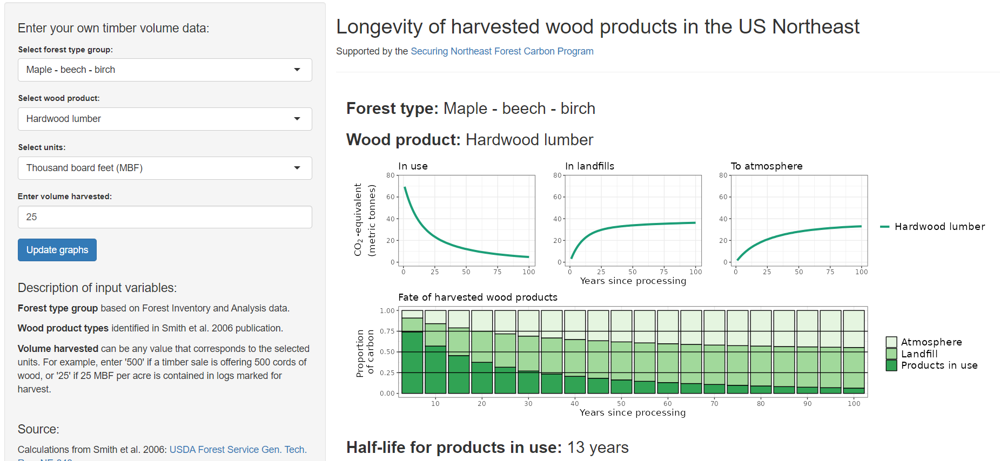

# Harvested wood products app, US Northeast
Server Shiny app file for harvested wood products calculator for the US Northeast. Contains equations from [Smith et al. 2006](https://www.fs.usda.gov/research/treesearch/22954) for determining amount of carbon stored in use, in landfills, and decayed to atmosphere.

